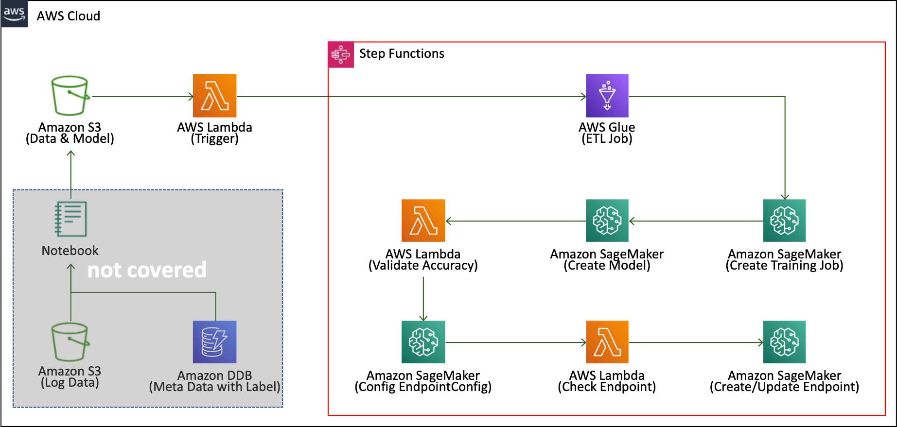
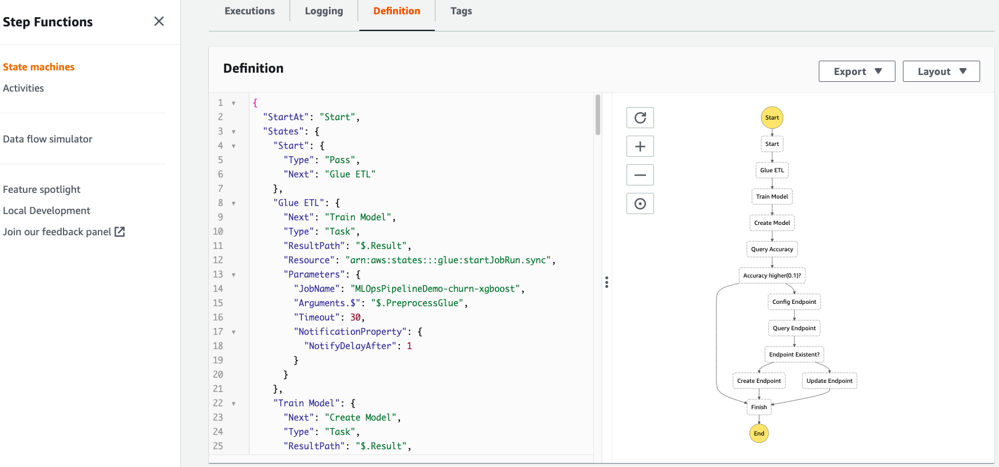
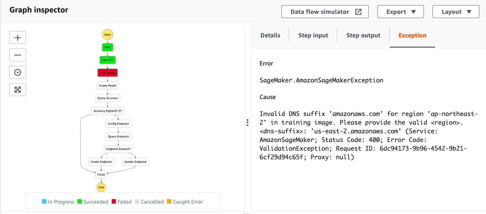
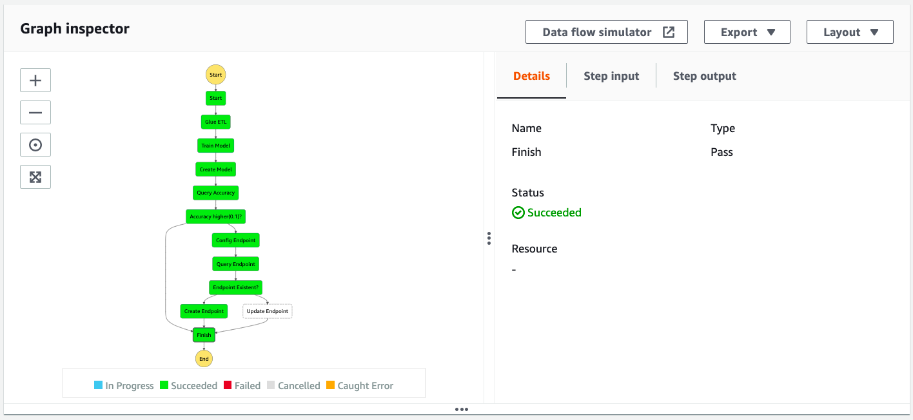
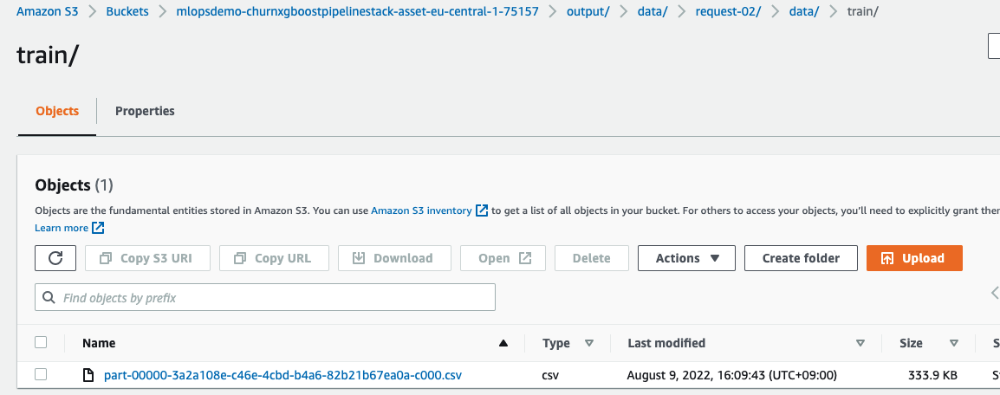
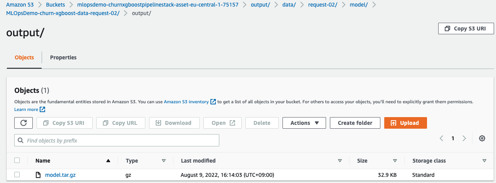
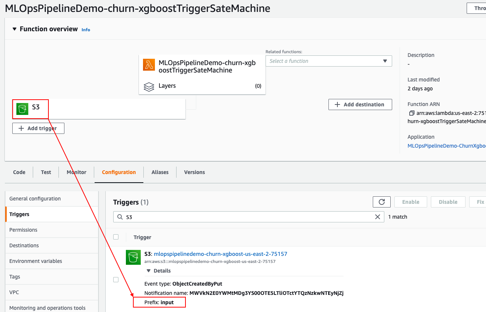
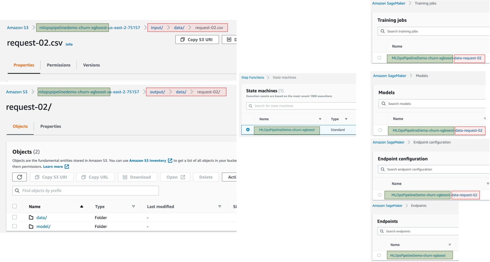

# Amazon SageMaker Built-in Algorithm MLOps Pipeline using AWS CDK

This repository provides a solution for MLOps Pipeline, where **MLOps Pipeline** includes data ETL, model re-training, model archiving, model serving and event triggering. Although this solution provides XGBoost as an example, it can be extended to other SageMaker built-in algorithms because it abstracts model training of SageMaker's built-in algorithms. AWS various services(Amazon SageMaker, AWS Step Functions, AWS Lambda) are used to provide MLOps Pipeline, and those resources are modeled and deployed through AWS CDK.

Other "Using AWS CDK" series can be found at:

- [Amazon Sagemaker Model Serving Using AWS CDK](https://github.com/aws-samples/amazon-sagemaker-model-serving-using-aws-cdk)
- [AWS ECS DevOps UsingAWS CDK](https://github.com/aws-samples/aws-ecs-devops-using-aws-cdk)
- [AWS Serverless Using AWS CDK](https://github.com/aws-samples/aws-serverless-using-aws-cdk)
- [AWS IoT Greengrass Ver2 using AWS CDK](https://github.com/aws-samples/aws-iot-greengrass-v2-using-aws-cdk)

## Solution Architecture

- ***Data ETL***: AWS Glue Job for data ETL(extract/transform/load)
- ***Model Build/Train***: Amazon SageMaker built-in(xgboost) algorithm and SageMaker training job
- ***Model Archive/Serve***: Amazon SageMaker Model/Endpoint for realtime inference
- ***Pipeline Orchestration***: AWS Step Functions for configuring a statemachine of MLOps pipeline
- ***Programming-based IaC***: AWS CDK for modeling & provisioning for all AWS cloud resources(Typescript)



This solution refers to [amazon-sagemaker-examples: automate_model_retraining_workflow](https://github.com/aws/amazon-sagemaker-examples/tree/master/step-functions-data-science-sdk/automate_model_retraining_workflow) for applying SageMaker built-in XGBoost algorithm. Please refer to the following links to apply other SageMaker built-in algorithms.

- [Amazon SageMaker Built-in Algorithms Intro](https://docs.aws.amazon.com/sagemaker/latest/dg/algos.html)
- [Amazon SageMaker Built-in Algorithms Docker Path](https://docs.aws.amazon.com/sagemaker/latest/dg/sagemaker-algo-docker-registry-paths.html)
- [Amazon SageMaker Built-in Algorithms Data Format](https://docs.aws.amazon.com/sagemaker/latest/dg/sagemaker-algo-common-data-formats.html)

Note that using SageMaker built-in algorithms is very convenient because we only need to focus on the data.

## CDK-Project Build & Deploy

To efficiently define and provision AWS cloud resources, [AWS Cloud Development Kit(CDK)](https://aws.amazon.com/cdk) which is an open source software development framework to define your cloud application resources using familiar programming languages is utilized.


Because this solusion is implemented in CDK, we can deploy these cloud resources using CDK CLI. In particular, **TypeScript** clearly defines restrictions on types, so we can easily and conveniently configure many parameters of various cloud resources with CDK. In addition, if programming, one of the advantages of CDK, is applied along with **design patterns**, it can be extended to more reusable assets.

### **CDK Useful commands**

- `npm install`     install dependencies only for Typescript
- `cdk list`        list up stacks
- `cdk deploy`      deploy this stack to your default AWS account/region
- `cdk diff`        compare deployed stack with current state
- `cdk synth`       emits the synthesized CloudFormation template

### **Prerequisites**

First of all, AWS Account and IAM User is required. And then the following modules must be installed.

- AWS CLI: aws configure --profile [profile name]
- Node.js: node --version
- AWS CDK: cdk --version
- [jq](https://stedolan.github.io/jq/): jq --version

Please refer to the kind guide in [CDK Workshop](https://cdkworkshop.com/15-prerequisites.html).

### **Configure AWS Credential**

```bash
aws configure --profile [your-profile] 
AWS Access Key ID [None]: xxxxxx
AWS Secret Access Key [None]:yyyyyyyyyyyyyyyyyyyyyyyyyyyyyy
Default region name [None]: us-east-2 
Default output format [None]: json
    
aws sts get-caller-identity --profile [your-profile]
...
...
{
    "UserId": ".............",
    "Account": "75157*******",
    "Arn": "arn:aws:iam::75157*******:user/[your IAM User ID]"
}
```

### **Check CDK project's entry-point**

In this CDK project, a entry-point file is **infra/app-main.ts** which is described in `cdk.json`.

### **Set up deploy config**

The `config/app-config-demo.json` file describes how to configure deploy condition & stack condition. First of all, change project configurations(Account, Profile are essential) in ```config/app-config-demo.json```.

```json
{
    "Project": {
        "Name": "MLOpsPipeline",   <----- Optional: your project name, all stacks wil be prefixed with [Project.Name+Project.Stage]
        "Stage": "Demo",           <----- Optional: your project stage, all stacks wil be prefixed with [Project.Name+Project.Stage]
        "Account": "75157*******", <----- Essential: update according to your AWS Account
        "Region": "us-east-2",     <----- Essential: update according to your target resion
        "Profile": "cdk-demo"      <----- Essential: AWS Profile, keep empty string if no profile configured
    },
    ...
    ...
}
```

And then set the path of this json configuration file through an environment variable.

```bash
export APP_CONFIG=config/app-config-demo.json
```

Through this external configuration injection, multiple deployments(multiple account, multiple region, multiple stage) are possible without code modification.

### **Install dependecies & Bootstrap**

For more details, open `script/setup_initial.sh` file.

```bash
sh script/setup_initial.sh config/app-config-demo.json
```

### **Deploy stacks**

Before deployment, please execute the following command for checking whether all configurations are ready.

```bash
cdk list
...
...
==> CDK App-Config File is config/app-config-demo.json, which is from Environment-Variable.

MLOpsPipelineDemo-ChurnXgboostPipelineStack

...
...
```

Check if you can see the list of stacks as shown above. If there is no problem, finally run the following command.

```bash
cdk deploy *ChurnXgboostPipelineStack --profile [optional: your profile name]
```

or

```bash
sh script/deploy_stacks.sh config/app-config-demo.json
```

***Caution***: This solution contains not-free tier AWS services. So be careful about the possible costs.

### **Check Deployment Results**

You can find the deployment results in AWS CloudFormation as shown in the following picture.


And you can see a new StateMachine in Step Functions, which looks like this.



## **How to triger the StateMachine**

Many resources such as Lambda/SageMakerTrainingJob/GlueETLJob have been deployed, but are not yet executed. Let's trigger that through just uploading input data.

### **Prepare a input data**

Download sample data by running the following command:

```bash
sh codes/glue/churn-xgboost/script/download_data.sh
```

A sample data will be downloaded in `codes/glue/churn-xgboost/data/input.csv`, and double quotes in this file will be removded to format `csv`.

### **Trigger the StateMachine in Step Functions**

Just execute the following command:

```bash
sh codes/glue/churn-xgboost/script/upload_input.sh config/app-config-demo.json data/request-01.csv
...
...
upload: codes/glue/churn-xgboost/data/input.csv to s3://mlopspipelinedemo-churn-xgboost-[region]-[account 5 digits]/input/data/request-01.csv
```

This command will upload `input.csv` file into S3 bucket such as `mlopspipelinedemo-churn-xgboost-[region]-[account 5 digits]` with `input/data/request-01.csv` key.


### **Check the execution result**

Let's go to `Step Functions` service in web console. We can see that the new one is currently running. Click on it to check the current status, which looks like this


When all steps are completed, you can see the following results.

AWS Glue ETL Job


Amazon SageMaker Training Job


***Caution*** Sometimes training job can be failed because container image path is wrong. In this case, you may see the following exception:



In this case, visit [SageMaker Docker Registry Path](https://docs.aws.amazon.com/sagemaker/latest/dg/sagemaker-algo-docker-registry-paths.html) link, where select your region, and then select alogorithm. Finaly, you can find the exptected docker path. For example, if your choice is `us-east-2` region and `XGBoost` algorithm, you will see a page like this - [https://docs.aws.amazon.com/sagemaker/latest/dg/ecr-us-east-2.html#xgboost-us-east-2.title](https://docs.aws.amazon.com/sagemaker/latest/dg/ecr-us-east-2.html#xgboost-us-east-2.title).

Please update docker image path in `app-config-demo.json` file and deploy the stack again. And finally, if you upload the input data to s3 with a different s3 key(`data/request-02.csv`), the StateMachine will start again.

```bash
sh script/deploy_stacks.sh config/app-config-demo.json
...
...
sh codes/glue/churn-xgboost/script/upload_input.sh config/app-config-demo.json data/request-02.csv
...
...
upload: codes/glue/churn-xgboost/data/input.csv to s3://mlopspipelinedemo-churn-xgboost-[region]-[account 5 digits]/input/data/request-02.csv
```

Amazon SageMaker Endpoint

***Caution*** In the first deployment, the SageMaker Endpoint is newly created(`Create Endpoint Path`), and in the second deployment, it is updated(`Update Endpoint Path`).

AWS Step Functions StateMachine


### **Check the execution output**

Internally, it is implemented so that intermediate results are archived according to the following rules.


AWS Glue ETL Job Result in AWS S3 Bucket


Amazon SageMaker Training Job Result in AWS S3 Bucket


### **How to invoke SageMaker-Endpoint**

Finally, let's inovoke `SageMaker Endpoint` to make sure it works well. 

Before invocation, open `codes/glue/churn-xgboost/script/test_invoke.py` file, and update `profile name` and `endpoint name` according to your configuration.

```python
...
...

os.environ['AWS_PROFILE'] = 'cdk-demo'
_endpoint_name = 'MLOpsPipelineDemo-churn-xgboost'

...
...
```

Invoke the endpoint by executing the following command:

```bash
python3 codes/glue/churn-xgboost/script/test_invoke.py
...
...
0 Invocation ------------------
>>input:  106,0,274.4,120,198.6,82,160.8,62,6.0,3,1,0,0,0,0,0,0,0,0,0,0,0,0,0,1,0,0,0,0,0,0,0,0,0,0,0,0,0,0,0,0,0,0,0,0,0,0,0,0,0,0,0,0,0,0,0,0,0,0,0,0,0,0,0,1,1,0,1,0
>>label:  0
>>prediction:  0.37959378957748413
1 Invocation ------------------
>>input:  28,0,187.8,94,248.6,86,208.8,124,10.6,5,0,0,0,0,0,0,0,0,0,0,0,0,0,0,0,0,0,0,0,0,0,0,0,0,0,0,0,0,0,0,0,0,0,0,0,0,0,0,0,0,0,0,0,0,0,0,0,0,0,0,0,1,0,1,0,1,0,1,0
>>label:  0
>>prediction:  0.03738965839147568
2 Invocation ------------------
>>input:  148,0,279.3,104,201.6,87,280.8,99,7.9,2,2,0,0,0,0,0,0,0,0,0,0,0,0,0,0,0,0,0,0,0,0,0,0,0,0,0,0,0,0,0,0,0,0,0,1,0,0,0,0,0,0,0,0,0,0,0,0,0,0,0,0,0,0,1,0,1,0,1,0
>>label:  1
>>prediction:  0.9195730090141296
3 Invocation ------------------
>>input:  132,0,191.9,107,206.9,127,272.0,88,12.6,2,1,0,0,0,0,0,0,0,0,0,0,0,0,0,0,0,0,0,0,0,0,0,0,0,0,0,0,0,0,0,0,0,0,0,0,0,0,0,1,0,0,0,0,0,0,0,0,0,0,0,0,0,0,0,1,1,0,1,0
>>label:  0
>>prediction:  0.025062650442123413
4 Invocation ------------------
>>input:  92,29,155.4,110,188.5,104,254.9,118,8.0,4,3,0,0,0,0,0,0,0,0,0,0,0,0,0,0,0,0,0,0,0,0,0,0,0,0,0,0,0,0,0,0,0,1,0,0,0,0,0,0,0,0,0,0,0,0,0,0,0,0,0,0,0,0,0,1,1,0,0,1
>>label:  0
>>prediction:  0.028299745172262192
```

## How to re-use or upgrade

### **How to re-trigger the StateMachine in Step Functions**

Because a S3-event trigger is registered in `Lambda Function`, it is restarted when you upload a file with a different name(s3 key) under `input` in `mlopspipelinedemo-churn-xgboost-region-account`.



A input S3 key will generate a unique title, it is used for `TrainingJobName`, `StateMachineExecutionName`, and s3 output key.



### **How to change deploy-configuration**

`ChurnXgboostPipeline` in `config/app-config-demo.json` file provides various deployment options. So change these values, and the re-deploy this stack. And trigger again.

```json
"ChurnXgboostPipeline": {
    "Name": "ChurnXgboostPipelineStack",

    "EndpointName": "churn-xgboost", <----- SageMaker Endpoint Name, and other resource name

    "GlueJobFilePath": "codes/glue/churn-xgboost/src/glue_etl.py", <----- Glue ETL Job Code
    "GlueJobTimeoutInMin": 30, <----- Glue ETL Job Timeout

    "TrainContainerImage": "306986355934.dkr.ecr.ap-northeast-2.amazonaws.com/xgboost:1", <------ This value is different according to SageMaker built-in algorithm & region
    "TrainParameters": {
        ...
    },
    "TrainInputContent": "text/csv", <----- This value is difference according to SageMaker built-in alorithm
    "TrainInstanceType": "c5.xlarge", <----- SageMaker training job instance type

    "ModelValidationEnable": true, <----- Enable/disable a model validation state
    "ModelErrorThreshold": 0.1, <----- Model accuracy validation metric threshold

    "EndpointInstanceType": "t2.2xlarge", <----- SageMaker endpoint instance number
    "EndpointInstanceCount": 1 <----- SageMaker ednpoint instance count
}
```

### **How to change hyper-parameter of XGBoost**

`ChurnXgboostPipeline` in `config/app-config-demo.json` file includes hyper-parameters like this. So change these values, and the re-deploy this stack. And trigger again.

```json
"ChurnXgboostPipeline": {
    "Name": "ChurnXgboostPipelineStack",

    ...
    ...
    "TrainParameters": {
        "max_depth": "5",
        "eval_metric": "error",
        "eta": "0.2",
        "gamma": "4",
        "min_child_weight": "6",
        "subsample": "0.8",
        "objective": "binary:logistic",
        "silent": "0",
        "num_round": "100"
    },
    ...
    ...
}
```

### **How to extend other SageMaker built-in algorithms**

`MLOpsePipelineStack` provides a general MLOps Pipeline as abstraction as possible for SageMaker built-in algorithms. As a result, it can be extended by injecting only configuration information without modifying the code.

For example, consider Object2Vec algorithm.

Step1: Prepare a new configuration in `config/app-config-demo.json`:

```json
{
    "Project": {
        ...
        ...
    },

    "Stack": {
        "ChurnXgboostPipeline": {
            "Name": "ChurnXgboostPipelineStack",

            ...
            ...
        },
        "RecommendObject2VecPipeline": {
            "Name": "RecommendObject2VecPipelineStack",

            "EndpointName": "recommand-object2vec", <----- change according model or usecase

            "GlueJobFilePath": "codes/glue/recommand-object2vec/src/glue_etl.py", <----- change according to data format and etl-process
            "GlueJobTimeoutInMin": 30, <----- change this value to avoid over-processing and over-charging

            "TrainContainerImage": "835164637446.dkr.ecr.ap-northeast-2.amazonaws.com/object2vec:1", <----- change image according to SageMaker built-in alorithm and region
            "TrainParameters": {
                "_kvstore": "device",
                "_num_gpus": "auto",
                "_num_kv_servers": "auto",
                "bucket_width": "0",
                "early_stopping_patience": "3",
                "early_stopping_tolerance": "0.01",
                "enc0_cnn_filter_width": "3",
                "enc0_layers": "auto",
                "enc0_max_seq_len": "1",
                "enc0_network": "pooled_embedding",
                "enc0_token_embedding_dim": "300",
                "enc0_vocab_size": "944",
                "enc1_layers": "auto",
                "enc1_max_seq_len": "1",
                "enc1_network": "pooled_embedding",
                "enc1_token_embedding_dim": "300",
                "enc1_vocab_size": "1684",
                "enc_dim": "1024",
                "epochs": "20",
                "learning_rate": "0.001",
                "mini_batch_size": "64",
                "mlp_activation": "tanh",
                "mlp_dim": "256",
                "mlp_layers": "1",
                "num_classes": "2",
                "optimizer": "adam",
                "output_layer": "mean_squared_error"
            },
            "TrainInputContent": "application/jsonlines", <----- change according to algorithm supported types
            "TrainInstanceType": "m4.xlarge", <--- change model training environments

            "ModelValidationEnable": false, <----- disable if you don't want to validate model accuracy
            "ModelErrorThreshold": 0.1,

            "EndpointInstanceType": "m4.xlarge",  <--- change model training environments
            "EndpointInstanceCount": 1 
        }
    }
}
```

Step2: Create a new object in `infra/app-main.ts` like this:

```typescript
new MLOpsPipelineStack(appContext, appContext.appConfig.Stack.ChurnXgboostPipeline);
new MLOpsPipelineStack(appContext, appContext.appConfig.Stack.RecommendObject2VecPipeline);
```

Step3: Deploy and trigger again with a new data

```bash
cdk list
cdk deploy *RecommendObject2VecPipelineStack --profile [optional: your profile name]
```

Sometimes you can extend functionality by inheriting from this stack for further expansion.

## How to clean up

Execute the following command, which will destroy all resources except S3 Bucket. So destroy these resources in AWS web console manually.

```bash
sh ./script/destroy_stacks.sh config/app-config-demo.json
```

or

```bash
cdk destroy *Stack --profile [optional: your profile name]
```

## Security

See [CONTRIBUTING](CONTRIBUTING.md#security-issue-notifications) for more information.

## License

This library is licensed under the MIT-0 License. See the LICENSE file.
